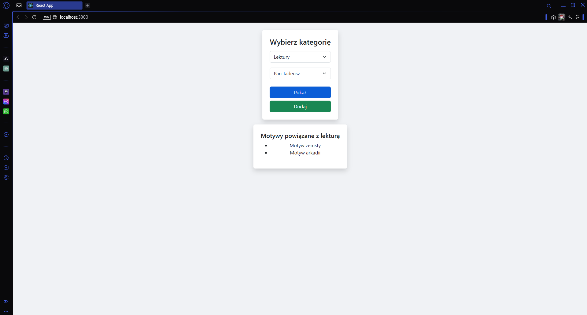

# Witam w projekcie lektur i motywów zwiazanych z nimi

Ogólne założenia to: pomoc jak i przypomnienie sobie przed maturą jakie motywy występowały w danej lekturze, lub w jakich lekturach znajdziemy dany motyw. 

## Jak odpali projekt?

Tworzysz projekt react w środowisku np VSC 

### `npx create-react-app .` (kropka lub ścieżka)

Odpala sie lokalnie na porcie 3000 tak jak poniżej
Otwórz [http://localhost:3000](http://localhost:3000) w przeglądarce

### Pobierz odpowiednie biblioteki przez `npm i`
np `npm i mysql2`

### Przy okazji odpal sobie serwer
Masz go w pliku server.js
Jak nie wiesz jak do niego wejśc to gdy znajdujesz się w głównym folderze wpisujesz w terminulu cd/server

### a następnie `node server.js`

### Pozmieniaj to co potrzebne i stwórz baze danych
ja mam łączoną zdalnie np plik .env i wpisz sobie te:
DB_HOST= wpisz np `localhost` albo coś

### A tu kilka screnów jak aplikacja działa

